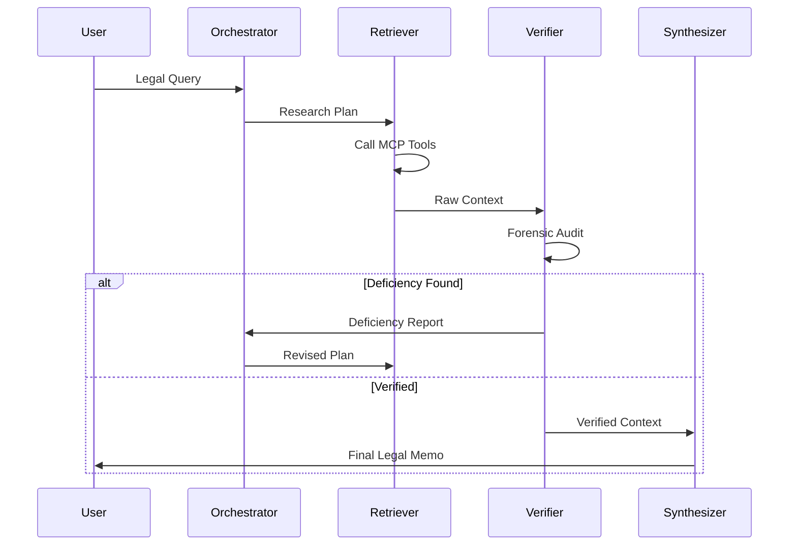

# 🏛️ LexiSwarm: Architectural Deep Dive

LexiSwarm is an autonomous, multi-agent ecosystem designed to solve the "Precision Gap" in standard Retrieval-Augmented Generation (RAG). By moving from a static pipeline to a dynamic swarm, LexiSwarm ensures that every legal claim is forensically audited against the source of truth before it ever reaches the user.

## 🧠 The Swarm Intelligence Model

Instead of a single LLM trying to "know everything," LexiSwarm employs a specialized swarm where agents operate in a state-managed loop.

### 1. The Orchestrator (The Brain)
- **Role**: Plans the research strategy.
- **Logic**: Analyzes the legal query for jurisdiction, relevant statutes, and case law types.
- **State**: Maintains the "Research Log" and decides when to retry based on deficiencies.

### 2. The MCP Retriever (The Hands)
- **Role**: Standardized data fetching.
- **Logic**: Uses the **Model Context Protocol (MCP)** to interface with external APIs (CourtListener) or local document stores.
- **Standardization**: By using MCP, we avoid brittle, custom connectors for every new database.

### 3. The Forensic Verifier (The Auditor)
- **Role**: Zero-Hallucination Guardrail.
- **Logic**: Executes a **Forensic Audit** on the retrieved context. It checks for:
    - Pinpoint citation accuracy.
    - Contextual relevance (avoiding "too-broad" cases).
    - Citation validity (is the case still good law?).
- **Loop Trigger**: If any audit fails, it issues a **Deficiency Report**, forcing the Orchestrator to replan.

### 4. The Synthesizer (The Counsel)
- **Role**: High-fidelity writing.
- **Logic**: Structures the final report in **IRAC** (Issue, Rule, Application, Conclusion) format.
- **Integrity**: Only uses the data explicitly passed through the Verifier's "Verified Context" filter.

---

## 🏗️ Technical Stack

- **Inference**: [Ollama](https://ollama.ai/) running `qwen2.5-coder:7b` (Logic) and `llama3.2:3b` (Routing).
- **Orchestration**: [LangGraph](https://python.langchain.com/docs/langgraph). This provides the stateful graph logic required for autonomous loops.
- **Data Protocol**: [Model Context Protocol (MCP)](https://modelcontextprotocol.io/).
- **Backend**: **FastAPI** with Server-Sent Events (SSE) for real-time swarm streaming.
- **Frontend**: **React/Vite** with **TailwindCSS** and **Framer Motion** for a premium Discovery Studio experience.

---

## 🔄 The Forensic Audit Loop (Data Flow)

