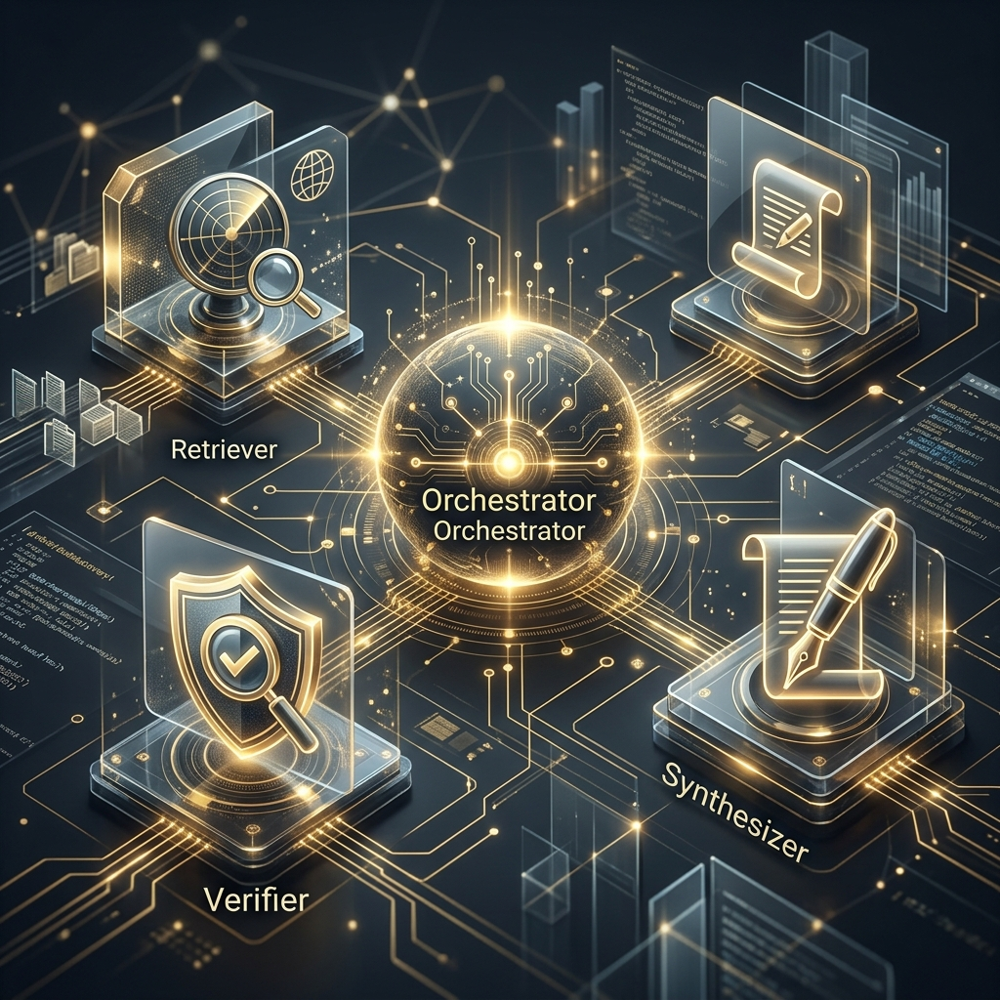
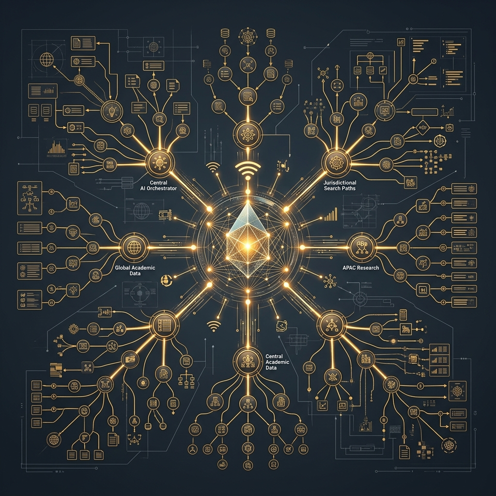

# Agentic RAG Swarm: Legal Intelligence & Discovery

An autonomous, multi-agent ecosystem for high-precision legal research, case law analysis, and forensic citation verification. LexiSwarm moves beyond standard RAG by implementing a **Forensic Audit Loop** that eliminates hallucinations in high-stakes legal contexts.

---

## 🏛️ Swarm Components

| **Orchestration** | **MCP Retrieval** | **Forensic Audit** |
| :---: | :---: | :---: |
|  |  |  |
| *Planning the Path* | *Standardized Data* | *Verification & Loop* |

---

## 🚀 The SaaSw Philosophy
LexiSwarm treats "Service as a Software" (SaaSw), where autonomous agents dynamically handle the logic and retrieval rather than relying on static interfaces. The **Forensic Verifier** acts as a zero-trust gateway, ensuring that every citation is pinpoint-accurate before synthesis.

## 🎓 Learning & Tutorials
Check out our detailed **[TUTORIAL.md](TUTORIAL.md)** for a step-by-step guide on:
- 🛠️ **Setup**: Getting the swarm running locally.
- 🧠 **Logic**: Customizing the agent swarm.
- 🔌 **MCP**: Adding your own data sources.
- 🌐 **Deployment**: Going live on the cloud.

---

## 📁 Repository Structure
- `/agents`: System prompts and logic for Orchestrator, Retriever, Verifier, and Synthesizer.
- `/mcp_servers`: Standardized connectors for CaseLaw (CourtListener API).
- `/core`: LangGraph state machine and orchestration logic.
- `/frontend`: Premium **Discovery Studio** web interface.
- `/evaluations`: Ragas-based benchmarks for hallucination rejection.
- `/local_inference`: Ollama Modelfiles and routing configs.

---

## ⚖️ Quick Start

1. **Backend**: `uvicorn api.server:server --port 8888`
2. **Frontend**: `cd frontend && npm run dev -- --port 3333`
3. **Open**: [http://localhost:3333](http://localhost:3333)

## 🧪 Documentation
For a deep dive into the swarm logic and data flow, see [ARCHITECTURE.md](ARCHITECTURE.md).
