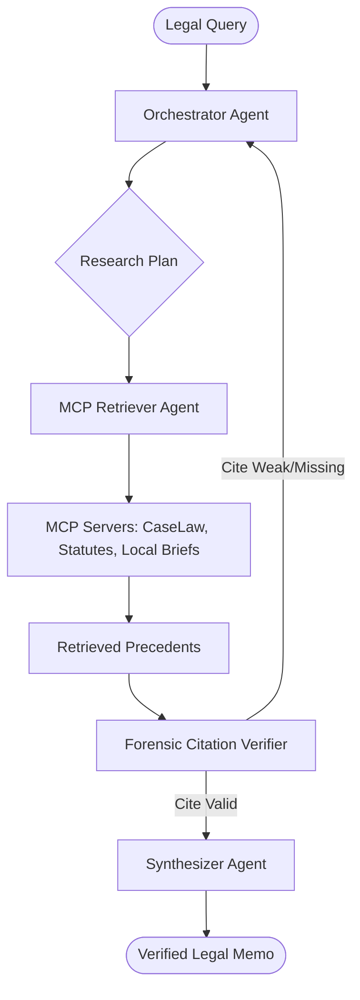

# Agentic RAG Swarm: Legal Intelligence & Discovery


An autonomous, multi-agent ecosystem for high-precision legal research, case law analysis, and forensic citation verification. LexiSwarm moves beyond standard RAG by implementing a **Forensic Audit Loop** that eliminates hallucinations in high-stakes legal contexts.

## 🏗️ Swarm Architecture



## 🚀 The SaaSw Philosophy
LexiSwarm treats "Service as a Software" (SaaSw), where autonomous agents dynamically handle the logic and retrieval rather than relying on static interfaces. The **Forensic Verifier** acts as a zero-trust gateway, ensuring that every citation is pinpoint-accurate before synthesis.

## 📁 Repository Structure
- `/agents`: System prompts and logic for Orchestrator, Retriever, Verifier, and Synthesizer.
- `/mcp_servers`: Standardized connectors for CaseLaw (CourtListener API).
- `/core`: LangGraph state machine and orchestration logic.
- `/frontend`: Premium **Discovery Studio** web interface.
- `/evaluations`: Ragas-based benchmarks for hallucination rejection.
- `/local_inference`: Ollama Modelfiles and routing configs.

---

## 🛠️ Getting Started

### 1. Prerequisites
- **Ollama**: Running locally.
- **Python 3.9+** and **Node.js**.

### 2. Install Dependencies
```bash
pip install -r requirements.txt
cd frontend && npm install
```

### 3. Configure Ollama
Create the specialized "LegalReasoner" model:
```bash
ollama create LegalReasoner -f local_inference/LegalReasoner.Modelfile
```

### 4. Setup Environment
Add your [CourtListener API Key](https://www.courtlistener.com/api/rest/v4/) to a `.env` file:
```env
COURTLISTENER_API_KEY=your_token_here
```

---

## ⚖️ Running the Discovery Studio

1. **Start the Backend API**:
   ```bash
   uvicorn api.server:server --host 0.0.0.0 --port 8000
   ```

2. **Start the Frontend Studio**:
   ```bash
   cd frontend
   npm run dev
   ```

3. **Open the Studio**: Navigate to [http://localhost:5173](http://localhost:5173).

## 🧪 Documentation & Deep Dive
For a detailed look at the swarm logic and data flow, see [ARCHITECTURE.md](ARCHITECTURE.md).
